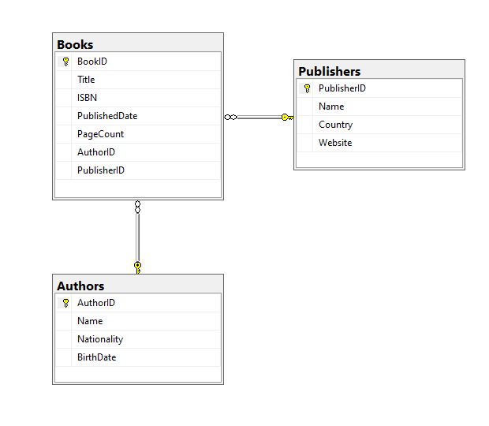
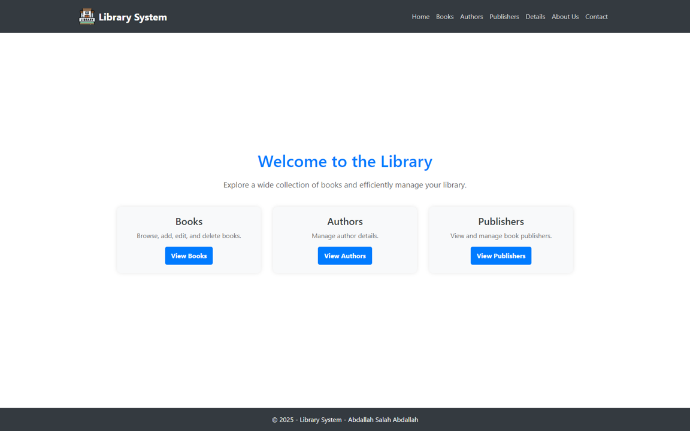
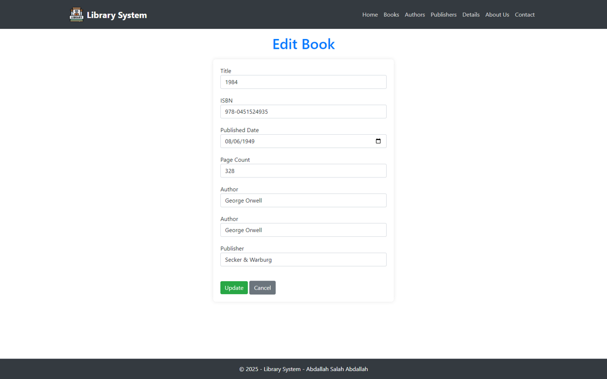
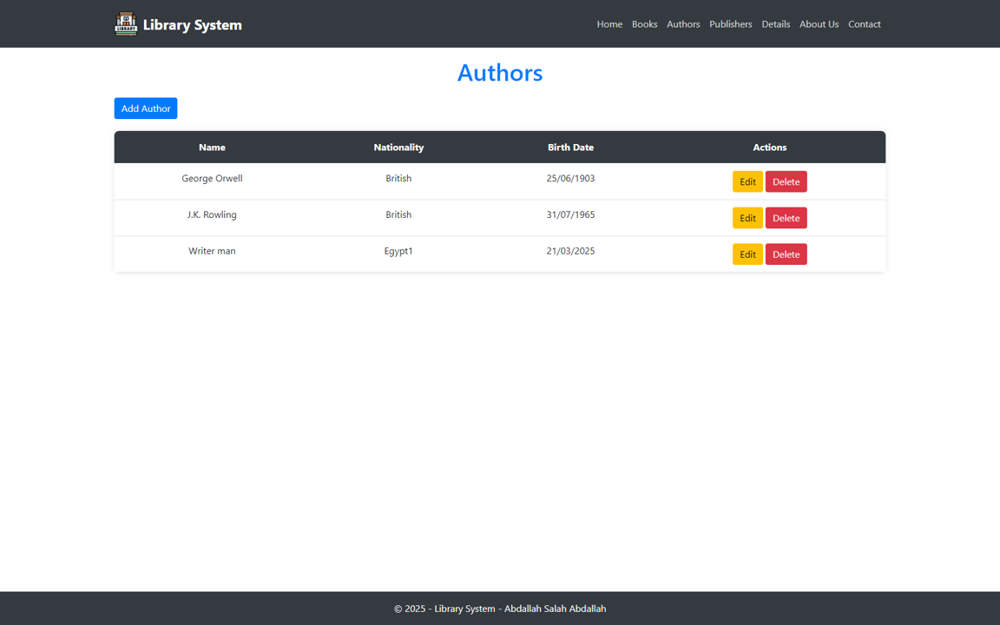
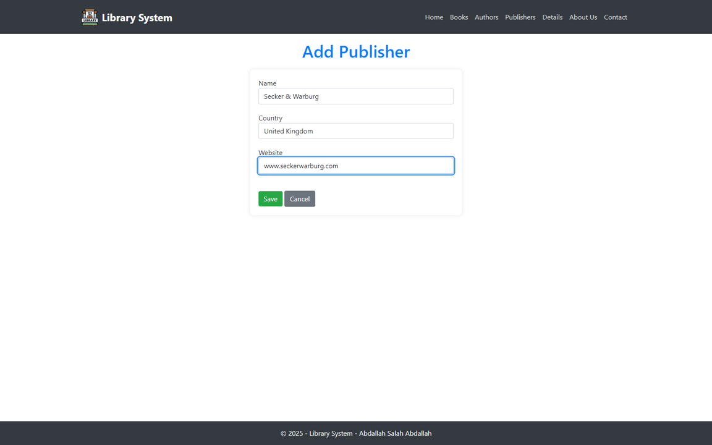
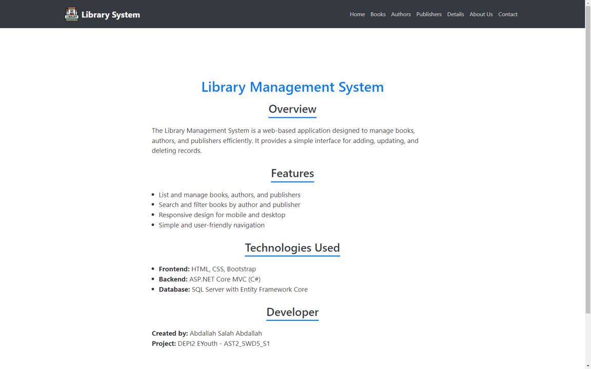
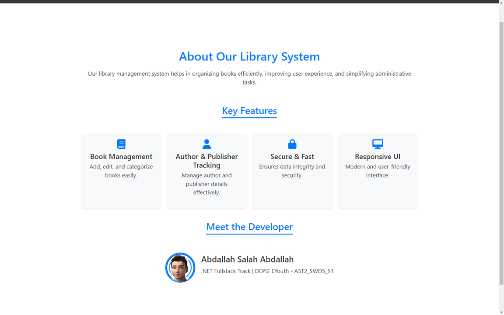
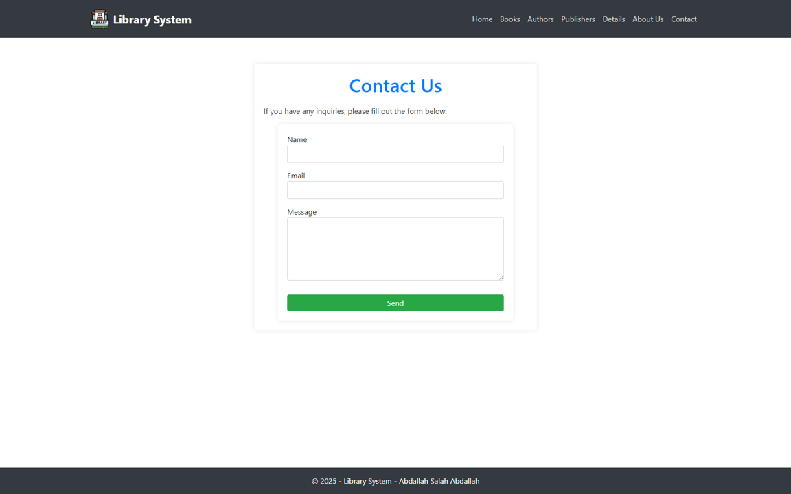

# 📚 Library Management System  

## 📌 Project Overview  
The Library Management System is a **full-stack** web application for managing books, authors, and publishers. This project was developed as part of the **DEPI .NET Fullstack - EYouth Internship (AST2_SWD5_S1)**.  

## 🛠️ Technologies Used  
- **Frontend:** ASP.NET Core MVC  
- **Backend:** .NET 8 (C#)  
- **Database:** Microsoft SQL Server  
- **ORM:** Entity Framework Core  
- **UI Framework:** Bootstrap  

## 🚀 Features  

### 📚 **Books**  
- View all books with author and publisher details  
- Add new books  
- Edit book information  
- Delete books  

### ✍️ **Authors**  
- View all authors  
- Add new authors  
- Edit author details  
- Delete authors  

### 🏢 **Publishers**  
- View all publishers  
- Add new publishers  
- Edit publisher details  
- Delete publishers  

## 🗄️ Database Schema  

### 📋 **Key Tables**  
- **Books** – Stores book details along with author and publisher IDs  
- **Authors** – Stores information about authors  
- **Publishers** – Stores publisher details  

## ⚙️ Installation & Setup  

### **Prerequisites**  
- .NET 8 SDK  
- Microsoft SQL Server  
- Visual Studio  

### **Setup Steps**  
1. Clone the repository:  
   ```sh
   git clone https://github.com/Agnefits/Library-System.git
   cd Library-System
   ```  
2. Install dependencies:  
   ```sh
   dotnet restore
   ```  
3. Configure the database connection in `appsettings.json`  
4. Apply migrations and update the database:  
   ```sh
   dotnet ef database update
   ```  
5. Run the application:  
   ```sh
   dotnet run
   ```  

## 📡 MVC Routes  

### 🏠 **Home**  
- `GET /Home` – Home page   
- `GET /Home/Details` – Project details 
- `GET /Home/About` – About the system  
- `GET /Home/Contact` – Contact us  

### 📚 **Books**  
- `GET /Book` – View all books  
- `GET /Book/Create` – Add new book form  
- `POST /Book/CreateBook` – Submit new book  
- `GET /Book/Edit/{id}` – Edit book form  
- `POST /Book/EditBook` – Update book  
- `POST /Book/Delete/{id}` – Delete book  

### ✍️ **Authors**  
- `GET /Author` – View all authors  
- `GET /Author/Create` – Add new author form  
- `POST /Author/CreateAuthor` – Submit new author  
- `GET /Author/Edit/{id}` – Edit author form  
- `POST /Author/EditAuthor` – Update author  
- `POST /Author/Delete/{id}` – Delete author  

### 🏢 **Publishers**  
- `GET /Publisher` – View all publishers  
- `GET /Publisher/Create` – Add new publisher form  
- `POST /Publisher/CreatePublisher` – Submit new publisher  
- `GET /Publisher/Edit/{id}` – Edit publisher form  
- `POST /Publisher/EditPublisher` – Update publisher  
- `POST /Publisher/Delete/{id}` – Delete publisher  

## 📷 Screenshots  

### 📊 Database Schema  
  

### 🏠 Home Page  
  

### ✏️ Edit Book  
  

### 👥 Show Authors  
  

### ➕ Add Publisher  
  

### 📄 Project Details  
  

### ℹ️ About Us  
  

### 📞 Contact Us  
  

## ☁️ Deployment  

1. Set up **environment variables** for production.  
2. Deploy the backend to **Azure / AWS / DigitalOcean**.  
3. Configure the **database connection** for production.  
4. Deploy the **MVC frontend** using IIS or a cloud hosting service.  

## 📜 License  
This project is **open-source** for educational and professional use. Contributions are welcome.  

## 📧 Contact  
For inquiries or contributions, contact **Abdallah Salah Abdallah**.  